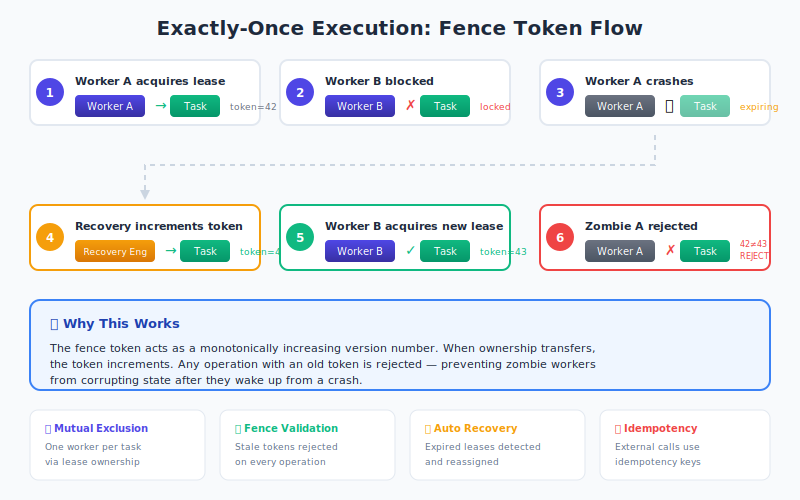
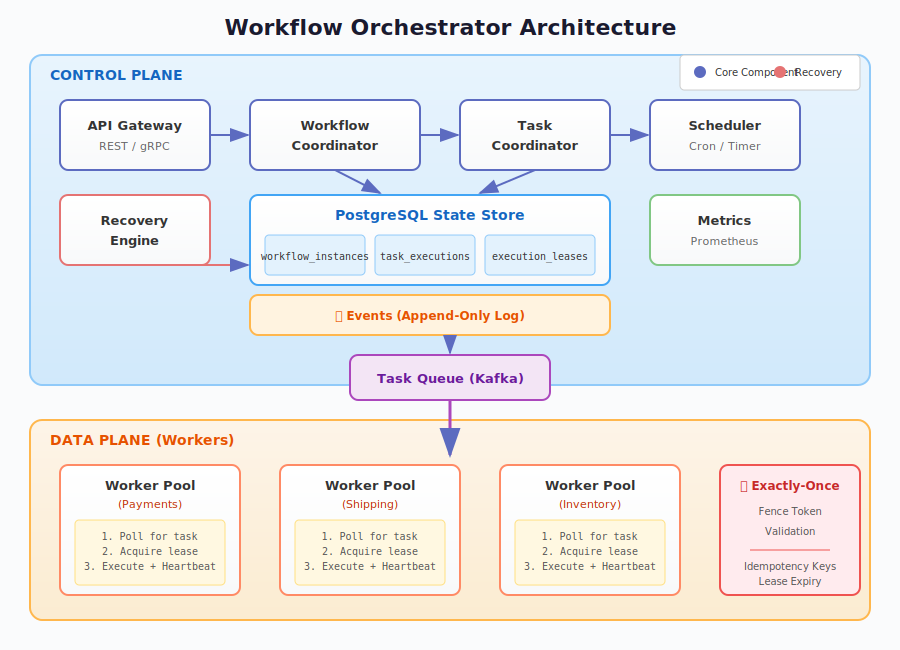

# Workflow Orchestrator

[](LICENSE)
[](https://openjdk.org/)
[](https://maven.apache.org/)
[](https://postgresql.org/)
[](https://kafka.apache.org/)

A production-grade, deterministic workflow orchestration engine with **exactly-once semantics**, automatic failure recovery, and saga-based compensation.

> 🚀 **Quick Links:** [Quick Start](#quick-start) • [Architecture](#architecture-overview) • [API Reference](#api-reference) • [Examples](orchestrator-examples/README.md)

## The Problem

Building reliable distributed workflows is hard. Common challenges include:

- **At-least-once headaches**: Traditional task queues may execute tasks multiple times on failures, leading to duplicate charges, duplicate emails, or inconsistent state.
- **Zombie workers**: A worker might crash mid-task. Who takes over? What about the work already done?
- **Lost state**: When your orchestrator restarts, how do you recover workflow progress without re-executing completed work?
- **Partial failures**: If step 5 of 7 fails, how do you undo steps 1-4?
- **Non-determinism**: Retries at different times may see different external state, causing divergent behavior.

This engine solves all of these problems.

## What Makes This Deterministic

Determinism means that **replaying a workflow from its event log always produces the same result**, regardless of when or where the replay happens.

### Key Mechanisms

| Mechanism | How It Works |
|-----------|--------------|
| **Event Sourcing** | All state changes are recorded as an immutable event log. Workflow state can be reconstructed by replaying events. |
| **Idempotency Keys** | Every task execution has a unique key (`{workflowId}:{taskId}:{attempt}`). External services use this to deduplicate requests. |
| **Fence Tokens** | Monotonically increasing tokens prevent stale workers from corrupting state after lease expiration. |
| **Strict State Machine** | Workflows follow defined state transitions. Invalid transitions are rejected. |
| **Deterministic Scheduling** | Task ordering is derived from the workflow DAG, not wall-clock time. |

## Exactly-Once Guarantees



> 📖 See [ARCHITECTURE.md](ARCHITECTURE.md#fence-tokens) for implementation details.

## Comparison: Airflow vs Temporal vs This Engine
**Summary**

- **Airflow** excels at batch scheduling and analytics workflows, but does not provide exactly-once guarantees.
- **Temporal** offers powerful deterministic replay but requires running and operating a dedicated Temporal cluster.
- **Workflow Orchestrator** focuses on correctness and simplicity for transactional workflows using standard infrastructure (Postgres).

| Category                    | Airflow              | Temporal               | Workflow Orchestrator       |
| --------------------------- | -------------------- | ---------------------- | --------------------------- |
| **Primary Use Case**        | Data pipelines (ETL) | Business workflows     | Transactional workflows     |
| **Execution Model**         | Scheduled DAG runs   | Event replay–based     | Event-sourced DAG           |
| **Exactly-Once Guarantees** | ❌ At-least-once    | ✅ Deterministic replay| ✅ Leases + fence tokens    |
| **Failure Recovery**        | Task retry           | Workflow replay        | Lease expiry & reassignment |
| **Compensation (Saga)**     | ❌ Manual            | ✅ Built-in           | ✅ Built-in                 |
| **State Management**        | External DB          | Temporal server        | Postgres + event log        |
| **Worker Model**            | Push-based           | Push-based             | Pull-based (leases)         |
| **Operational Complexity**  | Medium               | High                   | Low                         |
| **Best Fit**                | Batch & analytics    | Complex orchestration  | Financial & critical flows  |


### When to Use This Engine

✅ **Use this when:**
- You need exactly-once semantics for financial or transactional workflows
- You want automatic compensation (saga rollback) on failures
- You need human-in-the-loop approval steps
- You want a simple deployment (just Postgres, optionally Kafka)
- You're already running Java/Spring Boot services

❌ **Consider alternatives when:**
- You need sub-second latency (Temporal is faster for replay)
- You need complex data pipeline scheduling (Airflow is more mature)
- Your workflows span multiple services with different languages

## Architecture Overview



See [ARCHITECTURE.md](ARCHITECTURE.md) for detailed design documentation including state machines, the lease model, and sequence diagrams.

## Modules

| Module | Description |
|--------|-------------|
| `orchestrator-core` | Domain models, interfaces, and repository contracts |
| `orchestrator-engine` | Workflow coordinator, task coordinator, state management |
| `orchestrator-api` | REST API layer (Spring Boot) |
| `orchestrator-worker` | Worker SDK for implementing activity handlers |
| `orchestrator-scheduler` | Time-based scheduling (cron, delays) |
| `orchestrator-recovery` | Lease monitoring, failure detection, automatic recovery |
| `orchestrator-advisory` | LLM advisory layer for workflow insights (read-only) |
| `orchestrator-examples` | Example workflows including order processing demo |

## Quick Start

### Prerequisites

- Java 17+
- Maven 3.9+
- Docker (for PostgreSQL and Kafka)

### 1. Start Infrastructure

```bash
# Single node (development)
docker-compose up -d postgres kafka

# Full cluster with monitoring (production-like)
docker-compose --profile cluster --profile monitoring up -d
```

> 💡 The monitoring profile includes Prometheus + Grafana dashboards at `http://localhost:3000`

### 2. Build the Project

```bash
mvn clean install
```

### 3. Run the Demo

The demo showcases all key features without needing the full infrastructure:

```bash
cd orchestrator-examples
mvn exec:java -Dexec.mainClass="com.orchestrator.examples.order.OrderWorkflowDemo"
```

**Demo Output:**
```
╔══════════════════════════════════════════════════════════════════════╗
║     WORKFLOW ORCHESTRATOR - ORDER PROCESSING DEMONSTRATION           ║
╠══════════════════════════════════════════════════════════════════════╣
║  Demonstrating deterministic execution with exactly-once semantics   ║
╚══════════════════════════════════════════════════════════════════════╝

SCENARIO 1: Normal Successful Execution
SCENARIO 2: Automatic Retry on Transient Failure  
SCENARIO 3: Worker Crash Recovery (Lease Expiration)
SCENARIO 4: Duplicate Execution Prevention (Idempotency)
SCENARIO 5: Compensation on Failure (Saga Rollback)
```

### 4. Run the Full Orchestrator

```bash
cd orchestrator-api
mvn spring-boot:run
```

The API will be available at `http://localhost:8080`.

## Define a Workflow

```java
WorkflowDefinition workflow = WorkflowDefinition.builder()
    .namespace("orders")
    .name("order-fulfillment")
    .tasks(List.of(
        TaskDefinition.builder()
            .taskId("validate-order")
            .type(TaskType.ACTIVITY)
            .activityType("order.validate")
            .build(),
        TaskDefinition.builder()
            .taskId("process-payment")
            .type(TaskType.ACTIVITY)
            .activityType("payment.process")
            .compensationTaskId("refund-payment")  // Saga compensation
            .build(),
        TaskDefinition.builder()
            .taskId("ship-order")
            .type(TaskType.ACTIVITY)
            .activityType("shipping.create")
            .build()
    ))
    .edges(Map.of(
        "validate-order", List.of("process-payment"),
        "process-payment", List.of("ship-order")
    ))
    .entryTaskId("validate-order")
    .terminalTaskIds(Set.of("ship-order"))
    .build();
```

## Implement a Worker

```java
WorkerClient worker = new WorkerClient("http://localhost:8080");

worker.registerActivity("order.validate", context -> {
    // Get the idempotency key for external API calls
    String idempotencyKey = context.getIdempotencyKey();
    
    OrderInput order = context.getInput(OrderInput.class);
    
    // For long-running tasks, send heartbeats to renew the lease
    context.heartbeat();
    
    // Validate and return result
    ValidationResult result = validateOrder(order);
    return context.toJsonNode(result);
});

worker.start();
```

## Start a Workflow via API

```bash
curl -X POST http://localhost:8080/api/v1/workflows/orders/order-fulfillment/start \
  -H "Content-Type: application/json" \
  -d '{
    "runId": "order-123",
    "correlationId": "customer-456",
    "input": {
      "orderId": "order-123",
      "items": [{"sku": "ITEM-1", "quantity": 2}],
      "total": 99.99
    }
  }'
```

## API Reference

### Workflow APIs

| Endpoint | Method | Description |
|----------|--------|-------------|
| `/api/v1/workflows/{ns}/{name}/start` | POST | Start a new workflow instance |
| `/api/v1/workflows/{id}` | GET | Get workflow instance state |
| `/api/v1/workflows/{id}/signal` | POST | Send signal to workflow |
| `/api/v1/workflows/{id}/pause` | POST | Pause workflow execution |
| `/api/v1/workflows/{id}/resume` | POST | Resume paused workflow |
| `/api/v1/workflows/{id}/cancel` | POST | Cancel workflow |
| `/api/v1/workflows/{id}/compensate` | POST | Trigger saga compensation |

### Task APIs (Worker)

| Endpoint | Method | Description |
|----------|--------|-------------|
| `/api/v1/tasks/poll` | POST | Poll for available tasks |
| `/api/v1/tasks/{id}/complete` | POST | Complete task with result |
| `/api/v1/tasks/{id}/fail` | POST | Report task failure |
| `/api/v1/tasks/{id}/heartbeat` | POST | Renew task lease |

### History & Replay APIs

| Endpoint | Method | Description |
|----------|--------|-------------|
| `/api/v1/workflows/{id}/history` | GET | Get full execution history |
| `/api/v1/workflows/{id}/history/timeline` | GET | Get execution timeline |
| `/api/v1/workflows/{id}/history/replay` | GET | Replay state to point-in-time |
| `/api/v1/workflows/{id}/history/events` | GET | Get events in range |

### Admin APIs

| Endpoint | Method | Description |
|----------|--------|-------------|
| `/api/v1/tasks/{id}/force-complete` | POST | Force complete stuck task |
| `/api/v1/workflows/{id}/force-fail` | POST | Force fail stuck workflow |

## Configuration

Key configuration options in `application.yml`:

```yaml
orchestrator:
  lease:
    default-duration: 30s       # How long a worker holds a task
    renewal-interval: 10s       # How often workers should heartbeat
    
  recovery:
    lease-check-interval: 5s    # How often to check for expired leases
    stuck-workflow-threshold: 30m  # When to flag workflows as stuck
    
  retry:
    default-max-attempts: 3
    default-initial-backoff: 1s
    default-max-backoff: 5m
```

## Documentation

| Document | Description |
|----------|-------------|
| [ARCHITECTURE.md](ARCHITECTURE.md) | Detailed system design, state machines, lease model |
| [CONTRIBUTING.md](CONTRIBUTING.md) | How to contribute, coding standards |
| [orchestrator-examples/](orchestrator-examples/README.md) | Example workflows and demos |
| [docker-compose.yml](docker-compose.yml) | Local cluster setup with profiles |

### Module Documentation

Each module has its own README with specific usage instructions:

| Module | Purpose |
|--------|--------|
| [orchestrator-core](orchestrator-core/README.md) | Domain models and interfaces |
| [orchestrator-engine](orchestrator-engine/README.md) | Core coordination logic |
| [orchestrator-worker](orchestrator-worker/README.md) | Worker SDK |
| [orchestrator-api](orchestrator-api/README.md) | REST API layer |
| [orchestrator-recovery](orchestrator-recovery/README.md) | Failure recovery |
| [orchestrator-scheduler](orchestrator-scheduler/README.md) | Time-based scheduling |

## License

This project is licensed under the Apache License 2.0 - see the [LICENSE](LICENSE) file for details.

## Acknowledgments

Inspired by the design principles of:
- [Temporal](https://temporal.io/) - Workflow replay and determinism concepts
- [Uber Cadence](https://cadenceworkflow.io/) - Saga pattern implementation
- [Netflix Conductor](https://conductor.netflix.com/) - Task orchestration model
